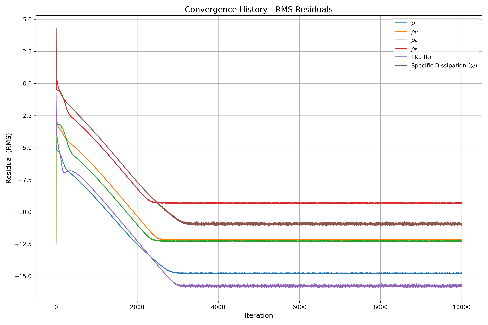
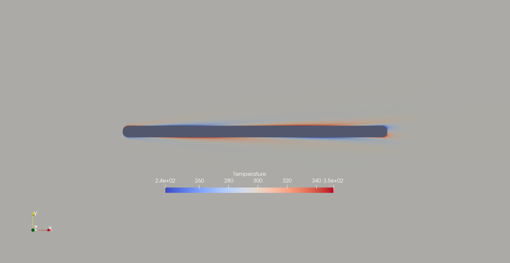
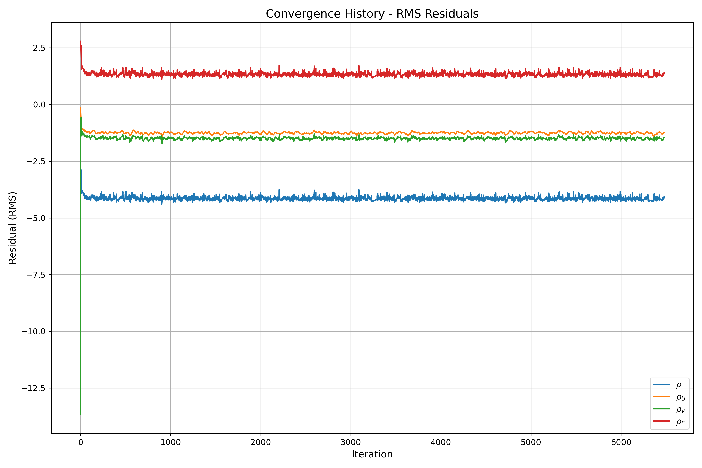
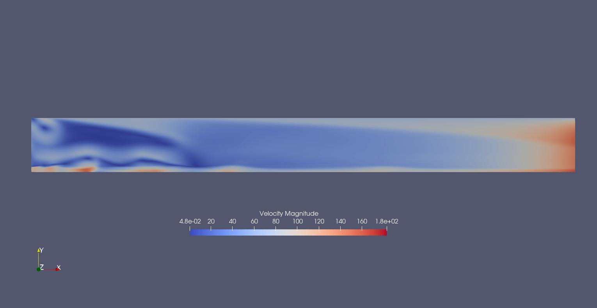
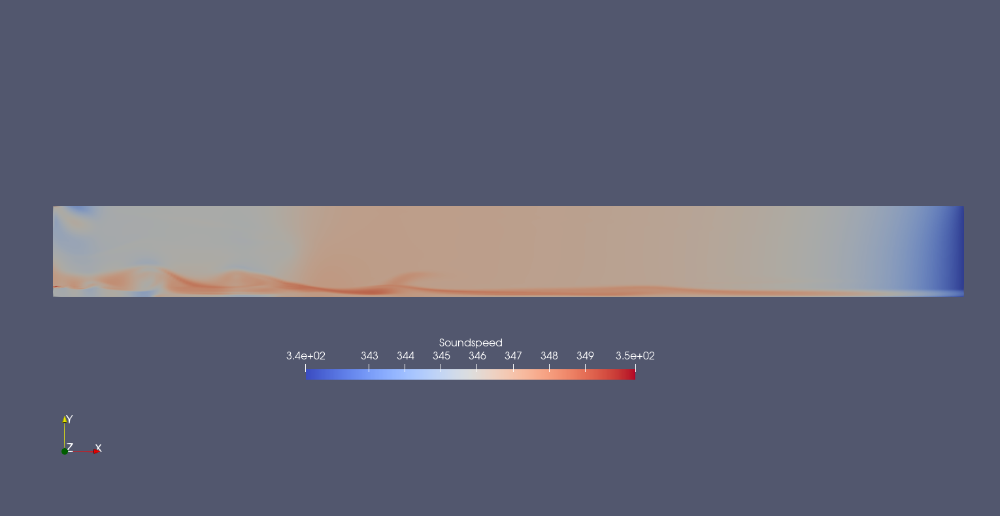

# GSoC 2025 Assignments for SU2

## Assignment-1: SU2 Installation with MPI and Python Wrappers

### Prerequisites
- OpenMPI 4.1.2 (verified with `mpirun --version`)
- SWIG (installed via package manager)
- Python 3 with mpi4py

### Installation Commands
```bash
./meson.py build -Denable-pywrapper=true --prefix=/home/baadalvm/SU2
```

After configuration, the script displayed instructions to add environment variables to `.bashrc`:
```bash
export SU2_RUN=/home/baadalvm/SU2/bin
export SU2_HOME=/home/baadalvm/SU2
export PATH=$PATH:$SU2_RUN
export PYTHONPATH=$PYTHONPATH:$SU2_RUN
```

These variables were manually added to `.bashrc`, then:
```bash
./ninja -C build install
```

## Visualization Setup
For visualizing results, ParaView was installed in a Conda environment:
```bash
conda create -n paraview_env python=3.9
conda activate paraview_env
conda install conda-forge::paraview
```
ParaView version 5.13.2 was successfully installed and used to visualize SU2 results.

## Assignment 2: Turbulent Jet Case
The provided geo file was used to create the mesh using gmsh and converted to su2 format using the following.
```bash
gmsh -2 jet_mesh.geo -save_all -o jet_mesh.su2 -format su2
```


The following changes were made.
1. The width of the domain was increased to 10 times the jet diameter.
2. The mesh was refined further


The configuration file of [Sandia Jet](https://github.com/su2code/VandV/tree/master/rans/SANDIA_jet) was used as starting point and changes were made to it according to the details in the provided [paper](https://www.researchgate.net/publication/254224677_Investigation_of_the_Mixing_Process_in_an_Axisymmetric_Turbulent_Jet_Using_PIV_and_LIF).

A simulation was run and some plots are shown below.

<p align="center">
  
  <br>
  <em>Convergence plot</em>
</p>

<p align="center">
  
  <br>
  <em>Velocity magnitude contours</em>
</p>

## Assignment 3: Using Python Wrapper
The mesh was downloaded from [here](https://github.com/su2code/TestCases/blob/master/py_wrapper/flatPlate_unsteady_CHT/2D_FlatPlate_Rounded.su2).

<p align="center">
  
  <br>
  <em>Computational Mesh</em>
</p>

The simulation was run using the python wrapper.
```bash
mpirun -np 4 python3 -m mpi4py launch_unsteady_CHT_FlatPlate.py --parallel -f unsteady_CHT_FlatPlate_Conf.cfg
```
<p align="center">
  
  <br>
  <em>Filled contours showing temperature variation of one complete cycle</em>
</p>


## Assignment 4: Modification of the python wrapper setup

This was done in two steps.
1. The simulation from assignment 3 was converted to steady state
2. The temporal variation was changed to spatial using the following.
```python
for iVertex in range(nVertex_CHTMarker):
    WallTemp = 293.0 + 57.0*sin(2*pi* iVertex / (nVertex_CHTMarker - 1))
    SU2Driver.SetMarkerCustomTemperature(CHTMarkerID, iVertex, WallTemp)
```

<p align="center">
  
  <br>
  <em>The warped surface showing the sinusoidally varying temperature</em>
</p>

<p align="center">
  
  <br>
  <em>Convergence plot</em>
</p>

<p align="center">
  
  <br>
  <em>Temperature contours</em>
</p>

## Assignment 5: Addition of New Volume Output
The second assignment was of incompressible flow. However in order to plot variation of local speed of sound a compressible case was set up. The configuration file from SU2 tutorial [Turbulen Flat Plate](https://github.com/su2code/Tutorials/blob/master/compressible_flow/Turbulent_Flat_Plate/turb_SA_flatplate.cfg) was used as a starting point.

In order to add the volume, screen and history output the source code of SU2 was explored. It was found that `/home/baadalvm/SU2/SU2_CFD/src/output/CFlowCompOutput.cpp` contained instructions on output of existing variables in compressible flow cases. The local speed of sound was added as `SOUNDSPEED`. 

> However for adding history and screen output, it was unclear as to what should these values be. For now, the values calculated for `RMS_DENSITY` was copied to `RMS_SS`. This was done only to demonstrate that the values could be printed. However, the actual calculation of `RMS_SS` is yet to be implemented. The discussed changes are shown below. The code was recompiled and run.

Changes in the source code
```diff
diff --git a/assignment_5/CFlowCompOutput.cpp b/assignment_5/CFlowCompOutput.cpp
index e460109..9254964 100644
--- a/assignment_5/CFlowCompOutput.cpp
+++ b/assignment_5/CFlowCompOutput.cpp
@@ -50,2 +50,3 @@ CFlowCompOutput::CFlowCompOutput(const CConfig *config, unsigned short nDim) : C
     requestedScreenFields.emplace_back("RMS_ENERGY");
+    requestedScreenFields.emplace_back("RMS_SS");
     nRequestedScreenFields = requestedScreenFields.size();
@@ -101,2 +102,5 @@ void CFlowCompOutput::SetHistoryOutputFields(CConfig *config){
 
+  // My Addition
+  AddHistoryOutput("RMS_SS",    "rms[SS]",  ScreenOutputFormat::FIXED, "RMS_SS", "Root-mean square of sound speed.", HistoryFieldType::RESIDUAL);
+  
   /// BEGIN_GROUP: RMS_RES, DESCRIPTION: The root-mean-square residuals of the SOLUTION variables.
@@ -240,2 +244,6 @@ void CFlowCompOutput::SetVolumeOutputFields(CConfig *config){
   AddVolumeOutput("MACH",        "Mach",                    "PRIMITIVE", "Mach number");
+  
+  // My Addition
+  AddVolumeOutput("SOUNDSPEED",        "Soundspeed",                    "PRIMITIVE", "local speed of sound");
+  
   AddVolumeOutput("PRESSURE_COEFF", "Pressure_Coefficient", "PRIMITIVE", "Pressure coefficient");
@@ -337,2 +345,5 @@ void CFlowCompOutput::LoadVolumeData(CConfig *config, CGeometry *geometry, CSolv
   
+  // My Addition
+  SetVolumeOutputValue("SOUNDSPEED", iPoint, Node_Flow->GetSoundSpeed(iPoint));
+
   const su2double factor = solver[FLOW_SOL]->GetReferenceDynamicPressure();
@@ -394,2 +405,6 @@ void CFlowCompOutput::LoadHistoryData(CConfig *config, CGeometry *geometry, CSol
 
+
+  // My Addition
+  SetHistoryOutputValue("RMS_SS", log10(flow_solver->GetRes_RMS(0)));
+
   SetHistoryOutputValue("RMS_DENSITY", log10(flow_solver->GetRes_RMS(0)));
```
The simulation did not converge for the values in the configuration file. However, the images are attached nonetheless to demonstrate that the code compiled and the desired outputs were obtained, but the values are not correct.


<p align="center">
  
  <br>
  <em>Residuals plot</em>
</p>

<p align="center">
  
  <br>
  <em>Velocity contours</em>
</p>

### Volume Output
<p align="center">
  
  <br>
  <em>Local speed of sound contours</em>
</p>

### Screen Output
```
------------------------------ Begin Solver -----------------------------

Simulation Run using the Single-zone Driver
WARNING: SU2 was not compiled for an AVX-capable architecture. Performance could be better,
         see https://su2code.github.io/docs_v7/Build-SU2-Linux-MacOS/#compiler-optimizations
+---------------------------------------------------+
|  Inner_Iter|   Time(sec)|    rms[Rho]|     rms[SS]|
+---------------------------------------------------+
|           0|  1.6321e-01|   -2.653052|   -2.653052|
|           1|  1.5855e-01|   -2.827255|   -2.827255|
|           2|  1.5220e-01|   -2.975579|   -2.975579|
|           3|  1.4938e-01|   -2.874256|   -2.874256|
|           4|  1.4732e-01|   -3.043686|   -3.043686|
|           5|  1.4597e-01|   -3.209436|   -3.209436|
|           6|  1.4424e-01|   -3.420064|   -3.420064|
|           7|  1.4211e-01|   -3.618999|   -3.618999|
|           8|  1.4131e-01|   -3.732643|   -3.732643|
|           9|  1.4100e-01|   -3.818958|   -3.818958|

----------------------------- Solver Exit -------------------------------
```


### History Output
```
Time_Iter","Outer_Iter","Inner_Iter",     "rms[SS]"    ,    "rms[Rho]"    ,    "rms[RhoU]"   ,    "rms[RhoV]"   ,    "rms[RhoE]"   ,     "rms[nu]"
          0,           0,           0,      -2.653051796,      -2.653051796,     -0.1324096923,       -13.6743582,       2.797015564,       -7.36042494
          0,           0,           1,      -2.827254643,      -2.827254643,     -0.3088112171,      -1.358660997,       2.619073945,      -7.276284674
          0,           0,           2,      -2.975579386,      -2.975579386,     -0.4766383633,       -1.11072433,       2.498680485,      -7.445716731
          0,           0,           3,      -2.874255962,      -2.874255962,     -0.5744251073,      -0.704001935,       2.603213505,      -7.670746395
          0,           0,           4,      -3.043686389,      -3.043686389,     -0.7477719572,     -0.5769750163,       2.432922665,      -7.6890```


